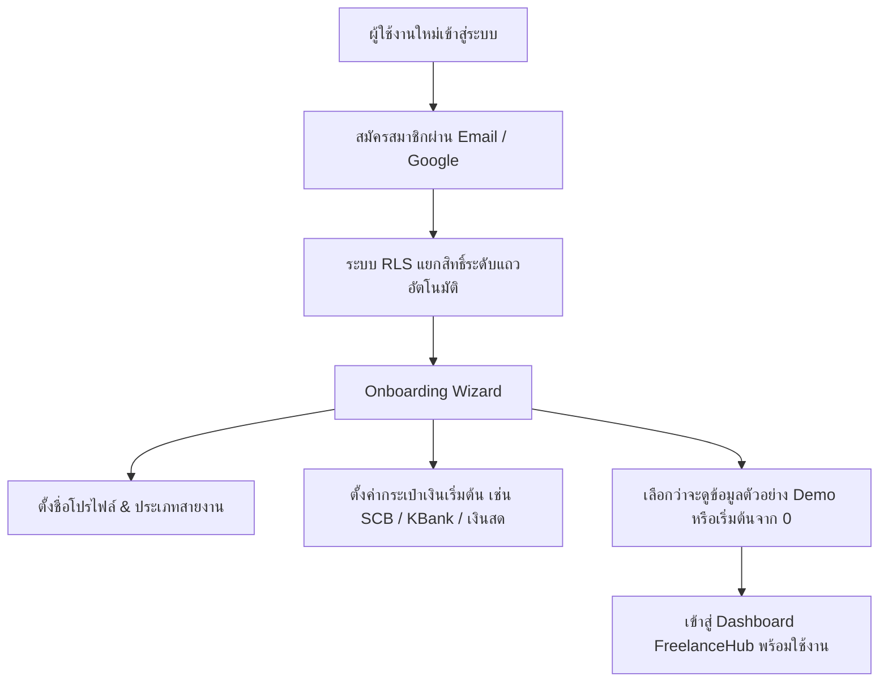
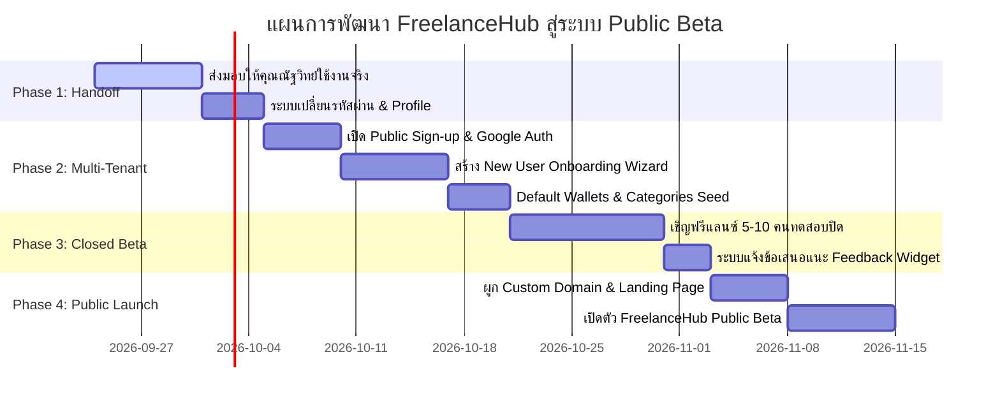

# 🗺️ FreelanceHub: Product Evolution Roadmap & Codex Collaboration Plan

> **เอกสารแผนยุทธศาสตร์และการพัฒนาระบบ FreelanceHub ร่วมกับ Codex**  
> **Repository:** `Sukky334576/FreelanceHub`  
> **Current Version:** v2.5 (Production Live on Cloudflare Pages)  
> **Status:** Phase 1 Complete (32/32 Tests Passing, RLS Enforced, Rebranded to FreelanceHub)  
> **Date:** กันยายน 2569 (September 2026)

---

## 📌 สารบัญ (Table of Contents)
1. [บทนำและสถานะปัจจุบัน (Executive Summary & Current State)](#1-บทนำและสถานะปัจจุบัน)
2. [ภารกิจเร่งด่วนในระยะส่งมอบ (Immediate Handoff & Validation)](#2-ภารกิจเร่งด่วนในระยะส่งมอบ)
3. [แนวทางการพัฒนาสู่ระบบ Multi-User สำหรับบุคคลภายนอก (Multi-Tenant Product Model)](#3-แนวทางการพัฒนาสู่ระบบ-multi-user)
4. [สถาปัตยกรรมและเทคโนโลยีที่ต้องเพิ่มเติม (Tech Stack & Infrastructure Additions)](#4-สถาปัตยกรรมและเทคโนโลยีที่ต้องเพิ่มเติม)
5. [แผนการดำเนินงานทีละเฟส (Phased Implementation Roadmap)](#5-แผนการดำเนินงานทีละเฟส)
6. [ความเสี่ยงและข้อควรระวังสำคัญ (Risk Assessment & Governance)](#6-ความเสี่ยงและข้อควรระวังสำคัญ)
7. [หัวข้อสำหรับการประชุมและตัดสินใจร่วมกับ Codex (Discussion Points for Codex)](#7-หัวข้อสำหรับการประชุมร่วมกับ-codex)

---

## 1. บทนำและสถานะปัจจุบัน

ระบบ **FreelanceHub** ได้รับการพัฒนา ปรับปรุงความถูกต้องทางการเงิน (Financial Accuracy) และรีแบรนด์จากสตูดิโอส่วนบุคคลสู่แพลตฟอร์มบริหารการเงินและคิวงานสำหรับฟรีแลนซ์อย่างเต็มรูปแบบ:

- **สถานะฐานข้อมูล:** Supabase PostgreSQL พร้อมฟังก์ชัน Atomic RPCs, deterministic wallet row locking (`FOR UPDATE`), และการบังคับใช้ Row Level Security (RLS) อย่างเข้มงวด
- **ความสมบูรณ์ของโค้ด:** ผ่าน Acceptance & Regression Verification Suite รวม **32 / 32 รายการ** (MR01–MR10, FR01–FR06, RR01–RR06, และ H02 Barrier Tests)
- **สถานะการติดตั้ง (Deployment):** Live บน Cloudflare Pages (`https://natthawit-studio.pages.dev/`)
- **ข้อมูลผู้ใช้งานตั้งต้น:** คุณณัฐวิทย์ (`natthawitstudio@gmail.com`) ยอดเงิน 3 บัญชีรวม ฿67,056.22, 638 รายการธุรกรรม, 148 คิวงาน ปลอดภัย 100%

---

## 2. ภารกิจเร่งด่วนในระยะส่งมอบ (Immediate Handoff & Validation)

ก่อนเปิดให้ผู้อื่นทดลองใช้งาน ควรทดสอบกระบวนการทำงานหลัก (End-to-End User Journeys) ร่วมกับคุณณัฐวิทย์:

### 2.1 การทดสอบการบันทึกรายการจริง (End-to-End Operational Testing)
- [ ] **ทดสอบบันทึกรายการธุรกรรมใหม่:** บันทึกรายรับ/รายจ่ายผ่านแถบ "บันทึกเงิน" ตรวจสอบว่ายอดเงินในกระเป๋าเงิน (Wallets) ปรับเปลี่ยนทันที และข้อมูลซิงค์ลง Supabase แบบ Real-time
- [ ] **ทดสอบระบบกระทบยอด (Bank Reconciliation):** ทดสอบการกดปุ่ม "ตรวจสอบยอด" และบันทึกปรับยอดเศษสตางค์ตามสมุดบัญชีธนาคารจริง
- [ ] **ทดสอบการสร้างคิวงาน & บันทึกรับเงิน:** สร้าง Job ใหม่ใน "ตารางงาน" เชื่อมโยงกับโปรเจกต์ และทดสอบบันทึกรับเงินมัดจำ/งวดงาน
- [ ] **ทดสอบการส่งออกเอกสาร:** ตรวจสอบความถูกต้องของใบเสนอราคา/ใบแจ้งหนี้ (PDF) และไฟล์สรุปบัญชี (Excel XLSX) ว่าแสดงแบรนด์ FreelanceHub สวยงามและคมชัด

### 2.2 ระบบจัดการบัญชีและความปลอดภัย (User Profile & Security)
- [ ] **หน้าต่างเปลี่ยนรหัสผ่าน (Self-Service Password Change):** สร้าง UI ในแท็บ "ตั้งค่า" ให้คุณณัฐวิทย์สามารถเปลี่ยนจากรหัสชั่วคราว (`StudioNatthawit2026!`) เป็นรหัสผ่านส่วนตัวได้เองโดยตรงผ่าน Supabase Auth API
- [ ] **ระบบรีเซ็ตรหัสผ่านผ่านอีเมล (Forgot Password Flow):** รองรับการส่ง Magic Link ไปยังอีเมลผู้ใช้กรณีลืมรหัสผ่าน

### 2.3 การจดและผูกชื่อโดเมนหลัก (Custom Domain Setup)
- [ ] จดทะเบียนโดเมนหลักที่เป็นสากล เช่น `freelancehub.app`, `freelancehub.co` หรือ `freelancehub.space`
- [ ] ผูกโดเมนเข้ากับ Cloudflare Pages ผ่าน Cloudflare DNS พร้อมเปิดใช้ Auto SSL, HTTP/3 และ Edge Caching

---

## 3. แนวทางการพัฒนาสู่ระบบ Multi-User

หากต้องการเปิดให้ **ฟรีแลนซ์คนอื่น** (ช่างภาพ, กราฟิกดีไซเนอร์, โปรแกรมเมอร์, คอนเทนต์ครีเอเตอร์) เข้ามาสมัครและใช้งาน ควรวางรูปแบบผลิตภัณฑ์ดังนี้:



### 3.1 รูปแบบการให้บริการ (Product Architecture)
1. **Multi-Tenant SaaS with Row Level Security (RLS):**
   - ผู้ใช้ทุกคนใช้ฐานข้อมูล Supabase เดียวกัน แต่ถูกแยกข้อมูลออกจากกัน 100% ด้วยคอลัมน์ `user_id = auth.uid()`
   - ไม่มีการแชร์ข้อมูลข้ามผู้ใช้ ผู้ใช้ A จะไม่มีทางเห็นธุรกรรม กระเป๋าเงิน หรือคิวงานของผู้ใช้ B ได้อย่างเด็ดขาด
2. **Onboarding Wizard (กระบวนการเริ่มต้นสำหรับผู้ใช้ใหม่):**
   - เมื่อผู้ใช้ใหม่สมัครเข้ามา จะยังไม่มีกระเป๋าเงิน (Wallets) ระบบต้องพาทำขั้นตอนง่ายๆ 3 สเต็ป:
     1. ใส่ชื่อสตูดิโอ / ชื่อฟรีแลนซ์
     2. สร้างกระเป๋าเงินแรก (เช่น บัญชีธนาคารรับเงินหลัก พร้อมระบุยอดเงินเริ่มต้น)
     3. เลือกหมวดหมู่รายรับ-รายจ่ายพื้นฐานที่ตรงกับสายงาน
3. **ทางเลือก "โหมดทดลองข้อมูล" (Demo / Playground Mode):**
   - ให้สลับดู "ข้อมูลจำลอง" (Mock Data) ได้ เพื่อให้ผู้ใช้ใหม่เห็นภาพว่าเมื่อมีข้อมูลครบ Dashboard และกราฟจะสวยงามเพียงใด ก่อนเริ่มกรอกข้อมูลจริงของตนเอง

---

## 4. สถาปัตยกรรมและเทคโนโลยีที่ต้องเพิ่มเติม

| ด้าน (Domain) | สิ่งที่ต้องใช้เพิ่ม (Tech Additions) | เหตุผลและความจำเป็น (Rationale) |
|---|---|---|
| **Authentication** | Supabase Auth (Sign-Up Enabled) + Google OAuth | ให้บุคคลภายนอกสามารถกดปุ่ม "Sign in with Google" ได้ในคลิกเดียว เพิ่ม Conversion การสมัคร |
| **Email Service** | Resend หรือ Brevo (SMTP Transactional) | สำหรับส่งอีเมลยืนยันตัวตน (Email Verification), ลิงก์รีเซ็ตรหัสผ่าน, และรายงานสรุปสิ้นเดือน |
| **Error Monitoring** | Sentry (Browser SDK) | ตรวจจับข้อผิดพลาด (Bugs / Crashes) ที่เกิดขึ้นบนอุปกรณ์ของผู้ใช้คนอื่นแบบ Real-time โดยที่ผู้ใช้ไม่ต้องแจ้ง |
| **Product Analytics** | PostHog หรือ Umami (Privacy-friendly) | วัดสถิติว่าผู้ใช้ชอบใช้ฟังก์ชันไหน (บันทึกเงิน, ตารางงาน, หรือออกบิล) โดยไม่ละเมิดความเป็นส่วนตัว |
| **Database Pooler** | Supavisor (Supabase Connection Pooler) | รองรับปริมาณผู้ใช้ที่เชื่อมต่อพร้อมกันจำนวนมาก ป้องกัน Database Connection Exhaustion |
| **File Storage** | Supabase Storage (S3-compatible) | ในอนาคตเมื่อผู้ใช้ต้องการแนบ "สลิปโอนเงิน" หรือ "รูปอุปกรณ์" ในระบบ |
| **Payment Gateway** | Stripe / Thai QR PromptPay (GB Prime Pay / Opn) | รองรับการเก็บค่าบริการรายเดือน (Subscription SaaS) สำหรับสมาชิกระดับ Pro |

---

## 5. แผนการดำเนินงานทีละเฟส (Phased Implementation Roadmap)



### เฟสที่ 1: การส่งมอบและทดสอบเชิงลึก (สัปดาห์ที่ 1 - 2)
- ให้คุณณัฐวิทย์ใช้งานเป็นเครื่องมือหลักประจำวันเป็นเวลา 7 วัน เพื่อเก็บประเด็นการใช้งานจริง (Friction points)
- พัฒนาฟังก์ชันเปลี่ยนรหัสผ่านในหน้าตั้งค่า
- ตรวจสอบประสิทธิภาพการตอบสนองบนสมาร์ทโฟน (iOS Safari & Android Chrome PWA)

### เฟสที่ 2: ระบบสมัครสมาชิกและต้อนรับผู้ใช้ใหม่ (สัปดาห์ที่ 3 - 4)
- ปรับแต่งหน้า `loginGateOverlay` ให้มีปุ่มสลับระหว่าง **"เข้าสู่ระบบ"** และ **"สร้างบัญชีใหม่"**
- พัฒนา Onboarding Wizard สำหรับผู้ใช้ที่เพิ่งสมัครครั้งแรก เพื่อสร้าง Default Wallet (เช่น บัญชีออมทรัพย์เริ่มต้น) อัตโนมัติ ป้องกันปัญหา `wallets = empty`
- เชื่อมต่อ Google OAuth ผ่าน Supabase Authentication

### เฟสที่ 3: เปิดทดสอบกลุ่มปิด (Closed Alpha / Beta) (สัปดาห์ที่ 5 - 6)
- เชิญฟรีแลนซ์กลุ่มแรก 5–10 คน (ช่างภาพ, นักตัดต่อ, ฟรีแลนซ์สายต่างๆ) เข้ามาทดลองใช้งาน
- ติดตั้งกล่องรับฟังความคิดเห็น (In-app Feedback / Bug Report Drawer)
- ปรับแต่ง UI/UX ตามพฤติกรรมการใช้งานจริงของกลุ่มตัวอย่าง

### เฟสที่ 4: การเปิดตัวสู่สาธารณะและโมเดลธุรกิจ (สัปดาห์ที่ 7 เป็นต้นไป)
- ทำหน้า Landing Page อธิบายจุดเด่นของ FreelanceHub (ปลอดภัย, คำนวณภาษีหัก ณ ที่จ่าย 3% อัตโนมัติ, ออกใบเสนอราคาได้ในคลิกเดียว)
- วางโครงสร้างราคา (Pricing Model):
  - **Free Tier:** ใช้งานฟรี บันทึกได้สูงสุด 150 รายการ/เดือน, 1 บัญชีกระเป๋าเงิน
  - **Pro Tier (฿99 - ฿149/เดือน):** ไม่จำกัดรายการ, กระเป๋าเงินไม่จำกัด, กระทบยอดธนาคาร, ส่งออก Excel ครบวงจร, ลบเครดิตใน PDF

---

## 6. ความเสี่ยงและข้อควรระวังสำคัญ (Risk Assessment & Governance)

```mermaid
quadrantChart
    title แผนภูมิวิเคราะห์ความเสี่ยงและมาตรการป้องกัน
    x-axis ผลกระทบต่ำ --> ผลกระทบสูง
    y-axis ความน่าจะเป็นต่ำ --> ความน่าจะเป็นสูง
    quadrant-1 เฝ้าระวังและเตรียมแผนสำรอง
    quadrant-2 ความเสี่ยงวิกฤต (ต้องมีระบบป้องกันอัตโนมัติ)
    quadrant-3 ความเสี่ยงรอง
    quadrant-4 มาตรการเชิงรุก (Proactive Control)
    "ข้อมูลรั่วไหลข้ามผู้ใช้ (Data Leak)": [0.95, 0.15]
    "Supabase Connection เกินขีดจำกัด": [0.70, 0.65]
    "ข้อผิดพลาดจากการกระทบยอด (Recon Drift)": [0.55, 0.40]
    "ผู้ใช้ลืมรหัสผ่านหรือไม่มี Email ยืนยัน": [0.60, 0.70]
    "ความล่าช้าในการบันทึกขณะ Offline": [0.40, 0.50]
```

### 1. ความปลอดภัยและการแยกข้อมูล (Data Isolation & Privacy)
- **ความเสี่ยง:** ข้อมูลการเงินเป็นข้อมูลที่มีความอ่อนไหวสูงมาก (Sensitive Personal Data) หากผู้ใช้คนหนึ่งมองเห็นยอดเงินของอีกคนจะทำลายความน่าเชื่อถือทันที
- **มาตรการป้องกัน:**
  - ยึดหลัก **Defense-in-Depth**: นโยบาย RLS ต้องมี `FORCE ROW LEVEL SECURITY` ทุกตาราง (ทำแล้วใน FR05)
  - ทุก RPC Function ต้องรับ `auth.uid()` จาก Session token เท่านั้น ห้ามรับ `p_user_id` จาก Client-side parameters
  - เขียน Automated Regression Test ตรวจสอบสิทธิ์แบบ Cross-tenant สม่ำเสมอ (ทำแล้วใน MR08 & N01)

### 2. ขีดจำกัดของ Cloud Resources (Supabase & Cloudflare Limits)
- **ความเสี่ยง:** แพ็กเกจฟรีของ Supabase มีข้อจำกัด:
  - Pause โครงการหากไม่มีการใช้งานต่อเนื่องเกิน 7 วัน
  - จำกัด Database Size ที่ 500 MB และ API Request Rate
- **มาตรการป้องกัน:**
  - เมื่อเริ่มมีผู้ใช้ภายนอกเกิน 10–20 คน แนะนำให้อัปเกรดเป็น **Supabase Pro ($25/เดือน)** เพื่อเปิดการสำรองข้อมูลอัตโนมัติ (Daily Backups) และปลดล็อกทรัพยากร
  - รันบน Cloudflare Pages ซึ่งรองรับ Unlimited Bandwidth และ DDoS Protection อยู่แล้ว

### 3. มาตรฐานทางกฎหมายและการคุ้มครองข้อมูล (PDPA Compliance)
- **ข้อกำหนด:** ในประเทศไทย พ.ร.บ. คุ้มครองข้อมูลส่วนบุคคล (PDPA) กำหนดให้:
  - ต้องมีหน้า **นโยบายความเป็นส่วนตัว (Privacy Policy)** และ **ข้อตกลงการใช้งาน (Terms of Service)**
  - ต้องมีปุ่มให้ผู้ใช้สามารถ **"ส่งออกข้อมูลทั้งหมดของฉัน (Data Portability)"** และ **"ลบบัญชีและข้อมูลทั้งหมดอย่างถาวร (Right to Erasure)"**

### 4. ประสบการณ์ใช้งานบนมือถือขณะเน็ตหลุด (Offline Resilience)
- **ความเสี่ยง:** ฟรีแลนซ์มักเดินทางไปกองถ่ายหรือนอกสถานที่ สัญญาณเน็ตอาจขาดหายขณะกำลังกดบันทึกเงิน
- **มาตรการป้องกัน:**
  - ใช้ Service Worker แคชไฟล์ Asset ของเว็บแอปไว้
  - ปรับปรุง Error Toast แจ้งเตือนชัดเจนเมื่อระบบไม่สามารถติดต่อ Server ได้ พร้อมปุ่มกด "ลองใหม่อีกครั้ง (Retry)"

---

## 7. หัวข้อสำหรับการประชุมและตัดสินใจร่วมกับ Codex

เมื่อนำเอกสารนี้ไปรีวิวและวางแผนร่วมกับ Codex มีหัวข้อหลักที่ควรให้ Codex ช่วยวิเคราะห์และตัดสินใจดังนี้:

1. **สถาปัตยกรรม Onboarding:**
   - Codex คิดเห็นอย่างไรกับการสร้าง Default Seed Data ให้กับผู้ใช้ใหม่ (ควรสร้างกระเป๋าเงินจำลองให้ทันทีผ่าน Trigger ใน PostgreSQL `after auth.users insert` หรือควรให้ผู้ใช้กรอกผ่าน Form หน้าเว็บ)?
2. **กลยุทธ์การเชื่อมโยง Payment Gateway สำหรับฟรีแลนซ์ไทย:**
   - เปรียบเทียบความคุ้มค่าและความง่ายในการ Integrate ระหว่าง **Stripe Billing** (ระบบระดับโลก สะดวกในการตัดบัตรเครดิต) กับ **PromptPay QR Code API** (คนไทยนิยมใช้มากที่สุดแต่จัดการ Webhook การโอนเงินต่างออกไป)
3. **การออกแบบสิทธิ์และองค์กร (Workspace / Team Collaboration):**
   - ในระยะยาว ฟรีแลนซ์อาจมีผู้ช่วย (Assistant) หรือช่างภาพร่วมทีม ควรออกแบบโครงสร้างตาราง `workspaces` และ `workspace_members` เพื่อรองรับการดูข้อมูลร่วมกันในอนาคตหรือไม่ อย่างไร?

---

*เอกสารฉบับนี้จัดทำขึ้นเพื่อใช้เป็นพิมพ์เขียวการทำงาน (Master Blueprint) ระหว่างทีมพัฒนา, Codex, และผู้บริหารโครงการ FreelanceHub*
